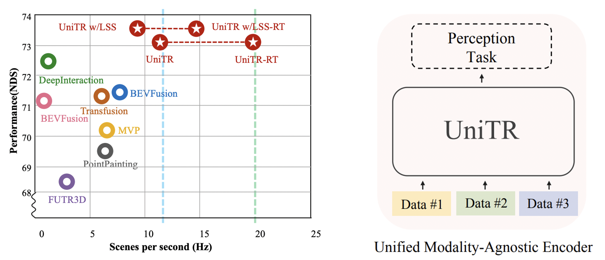
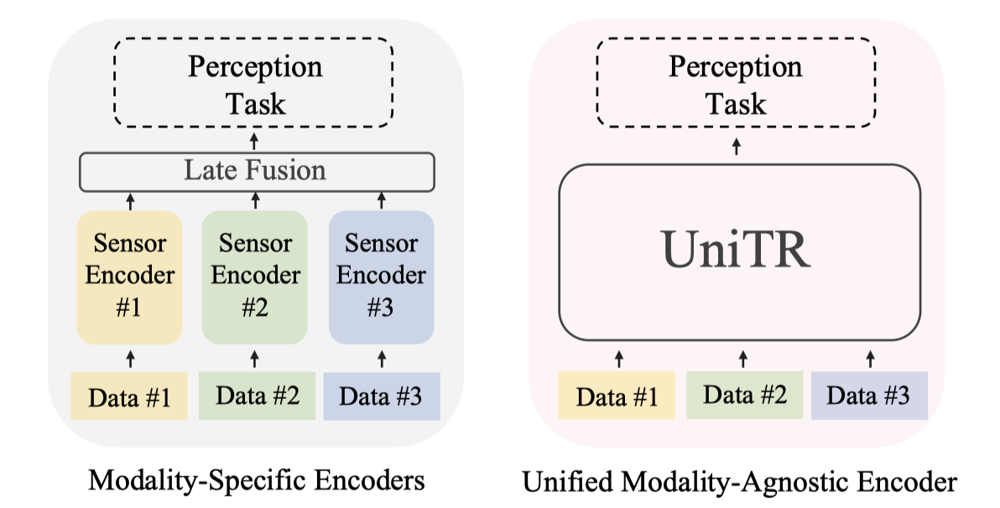
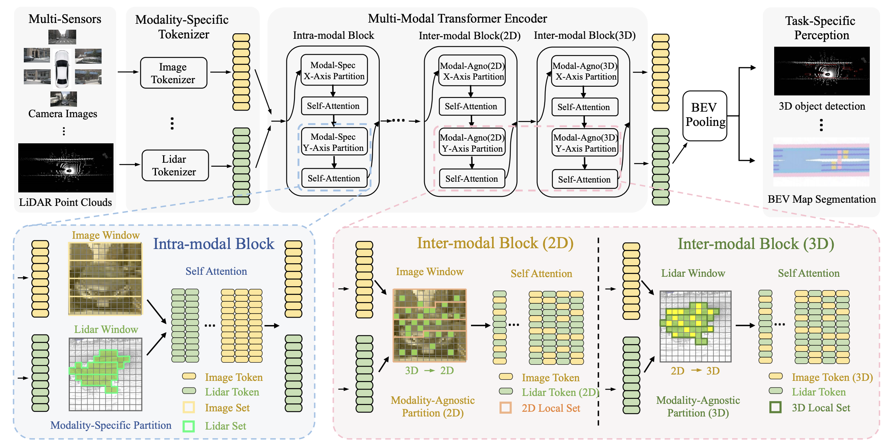
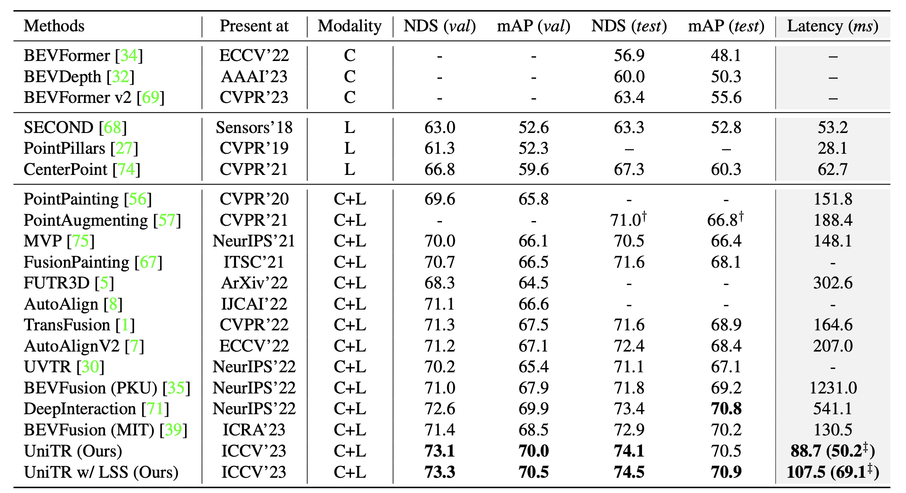
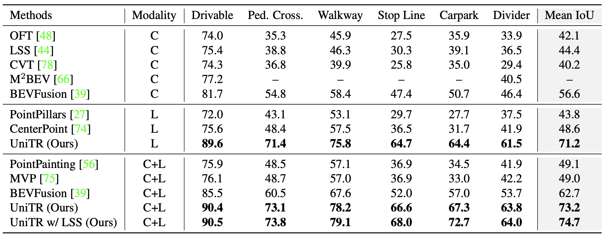
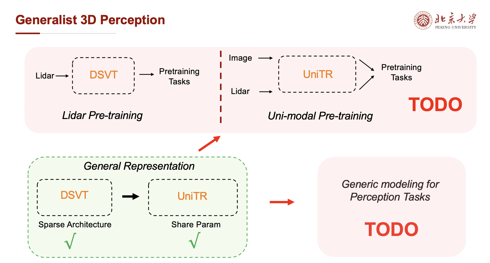

# UniTR: The First Unified Multi-modal Transformer Backbone for 3D Perception

This repo is the official implementation of **ICCV2023** paper: [UniTR: A Unified and Efficient Multi-Modal Transformer for Bird's-Eye-View Representation](http://arxiv.org/abs/2308.07732) as well as the follow-ups. Our UniTR achieves state-of-the-art performance on nuScenes Dataset with a real unified and weight-sharing multi-modal (e.g., `Cameras` and `LiDARs`) backbone. UniTR is built upon the codebase of [DSVT](https://github.com/Haiyang-W/DSVT), we have made every effort to ensure that the codebase is clean, concise, easily readable, state-of-the-art, and relies only on minimal dependencies.

<div align="center">
  
</div>

> UniTR: A Unified and Efficient Multi-Modal Transformer for Bird's-Eye-View Representation
>
> [Haiyang Wang*](https://scholar.google.com/citations?user=R3Av3IkAAAAJ&hl=en&oi=ao), [Hao Tang*](https://scholar.google.com/citations?user=MyarrsEAAAAJ&hl=en), [Shaoshuai Shi](https://scholar.google.com/citations?user=DC9wzBgAAAAJ&hl=en&oi=ao) $^\dagger$, [Aoxue Li](https://openreview.net/profile?id=~Aoxue_Li2), [Zhenguo Li](https://scholar.google.com/citations?hl=en&user=XboZC1AAAAAJ&view_op=list_works&sortby=pubdate), [Bernt Schiele](https://scholar.google.com/citations?user=z76PBfYAAAAJ&hl=en), [Liwei Wang](https://scholar.google.com/citations?user=VZHxoh8AAAAJ&hl=en) $^\dagger$
> 
> Contact: Haiyang Wang (wanghaiyang6@stu.pku.edu.cn), Hao Tang (tanghao@stu.pku.edu.cn), Shaoshuai Shi (shaoshuaics@gmail.com)

🚀 Gratitude to Tang Hao for extensive code refactoring and noteworthy contributions to open-source initiatives. His invaluable efforts were pivotal in ensuring the seamless completion of UniTR.

🔥 👀 Honestly, the partition in Unitr is slow and takes about 40% of the total time, but this can be optimized to zero with better strategies or some engineering efforts, indicating that there is still huge room for speed optimization. We're not the HPC experts, but if anyone in the industry wants to improve this, we believe it could be halved. Importantly, this part doesn't scale with model size, making it friendly for larger models.

📘 I am going to share my understanding and future plan of the general 3D perception foundation model without reservation. Please refer to 🔥 [Potential Research](https://github.com/Haiyang-W/UniTR#potential-research)🔥 . If you find it useful for your research or inspiring, feel free to join me in building this blueprint.

Interpretive Articles: [[CVer](https://mp.weixin.qq.com/s/du0Xtla0Wu-6-9qvhBiYPQ)] [[自动驾驶之心](https://mp.weixin.qq.com/s/Cn7IQz9HDftBYFduM6F5pQ)] [[ReadPaper](https://readpaper.com/paper/4789334767438921729)] [[知乎](https://zhuanlan.zhihu.com/p/658365971)] [[CSDN](https://blog.csdn.net/amusi1994/article/details/133287011)] [[TechBeat (将门创投)](https://www.techbeat.net/article-info?id=5371)]

## News
- [24-07-01] 🔥 Our [GiT](https://github.com/Haiyang-W/GiT) was accepted by **ECCV2024**. If you find it helpful, please give it a star. 🤗
- [24-03-15] 🔥 [GiT](https://github.com/Haiyang-W/GiT), the first successful general vision model only using a ViT is released. Corresponding to [Potential Research](https://github.com/Haiyang-W/UniTR#potential-research), we attempted to address problems with the general model on the vision side. Combining UniTR and GiT to construct an LLM-like unified model suitable for autonomous driving scenarios is an intriguing direction.
- [23-09-21] 🚀 Code of NuScenes is released.
- [23-08-16] 🏆  `SOTA` Our single multi-modal UniTR outshines all other non-TTA approaches on [nuScenes Detection benchmark](https://www.nuscenes.org/object-detection?externalData=all&mapData=all&modalities=Any) (Aug 2023) in terms of NDS `74.5`. 
- [23-08-16] 🏆  `SOTA` performance of multi-modal 3D object detection and BEV Map Segmentation on NuScenes validation set.
- [23-08-15] 👀 UniTR is released on [arXiv](http://arxiv.org/abs/2308.07732).
- [23-07-13] 🔥 UniTR is accepted at [ICCV 2023](https://iccv2023.thecvf.com/).

## Overview
- [👀 Todo](https://github.com/Haiyang-W/UniTR#todo)
- [🤔 Introduction](https://github.com/Haiyang-W/UniTR#introduction)
- [🚀 Main Results](https://github.com/Haiyang-W/UniTR#main-results)
- [🛠️ Quick Start](https://github.com/Haiyang-W/UniTR#quick-start)
- [📘 Citation](https://github.com/Haiyang-W/UniTR#citation)
- [🚀 Acknowledgments](https://github.com/Haiyang-W/UniTR#acknowledgments)

## TODO

- [x] Release the [arXiv](http://arxiv.org/abs/2308.07732) version.
- [x] SOTA performance of multi-modal 3D object detection (Nuscenes) and BEV Map Segmentation (Nuscenes).
- [x] Clean up and release the code of NuScenes.
- [ ] Merge UniTR to [OpenPCDet](https://github.com/open-mmlab/OpenPCDet).

## Introduction
Jointly processing information from multiple sensors is crucial to achieving accurate and robust perception for reliable autonomous driving systems. However, current 3D perception research follows a modality-specific paradigm, leading to additional computation overheads and inefficient collaboration between different sensor data. 
<div align="center">
  
</div>

In this paper, we present an efficient multi-modal backbone for outdoor 3D perception, which processes a variety of modalities with unified modeling and shared parameters. It is a fundamentally task-agnostic backbone that naturally supports different 3D perception tasks. It sets a new state-of-the-art performance on the nuScenes benchmark, achieving `+1.1 NDS` higher for 3D object detection and `+12.0 mIoU` higher for BEV map segmentation with lower inference latency.
<div align="center">
  
</div>

## Main results
### 3D Object Detection (on NuScenes validation)
|  Model  | NDS | mAP |mATE | mASE | mAOE | mAVE| mAAE | ckpt | Log |
|---------|---------|--------|---------|---------|--------|---------|--------|--------|--------|
|  [UniTR](https://github.com/Haiyang-W/UniTR/blob/main/tools/cfgs/nuscenes_models/unitr.yaml) | 73.0 | 70.1 | 26.3 | 24.7 | 26.8 | 24.6 | 17.9 | [ckpt](https://drive.google.com/file/d/10_1QCJ2uJqQ5XBSX6SQ2EVxFFais38fK/view?usp=sharing)| [Log](https://drive.google.com/file/d/1TfPRr4bItJxgScjdxMme4-C5Lb0Mjies/view?usp=sharing)|
|  [UniTR+LSS](https://github.com/Haiyang-W/UniTR/blob/main/tools/cfgs/nuscenes_models/unitr%2Blss.yaml) | 73.3 | 70.5 | 26.0 | 24.4 | 26.8 | 24.8 | 18.7 | [ckpt](https://drive.google.com/file/d/1D-_RRN2P9MnI2u8DWRNt7I2-58gohRQ_/view?usp=sharing)| [Log](https://drive.google.com/file/d/1mWDXF22YmeQnHvrmLTehRJGrXySvl0NK/view?usp=sharing)|


### 3D Object Detection (on NuScenes test)
|  Model  | NDS | mAP | mATE | mASE | mAOE | mAVE| mAAE |
|---------|---------|--------|--------|---------|---------|--------|---------|
|  UniTR | 74.1 | 70.5 | 24.4 | 23.3 | 25.7 | 24.1 | 13.0 |
|  UniTR+LSS | 74.5 | 70.9 | 24.1 | 22.9 | 25.6 | 24.0 | 13.1 |

### Bev Map Segmentation (on NuScenes validation)
|  Model  | mIoU | Drivable |Ped.Cross.| Walkway |  StopLine  | Carpark |  Divider  |  ckpt | Log |
|---------|----------|--------|--------|--------|--------|---------|--------|---------|--------|
|  [UniTR](https://github.com/Haiyang-W/UniTR/blob/main/tools/cfgs/nuscenes_models/unitr_map.yaml) | 73.2  | 90.4   |   73.1   |   78.2   |   66.6   |   67.3  |   63.8   |  [ckpt](https://drive.google.com/file/d/1x189DFgx04SeoyVDkDoZj-FpMPzgYkcn/view?usp=sharing)| [Log](https://drive.google.com/file/d/1HOtmgS1SqTczwII1F8iieaerwzi3aiez/view?usp=sharing)|
|  [UniTR+LSS](https://github.com/Haiyang-W/UniTR/blob/main/tools/cfgs/nuscenes_models/unitr_map%2Blss.yaml) |74.7 |   90.7   |   74.0   |   79.3   |   68.2   |   72.9  |   64.2   | [ckpt](https://drive.google.com/file/d/1Jr-dlrWxJEKe0RKaf3iTPr0lYgUEFjBL/view?usp=sharing)| [Log](https://drive.google.com/file/d/1-76K3GRs3QoxcL6Q9nCCokABBkcPICtb/view?usp=sharing)|

### What's new here?
#### 🔥 Beats previous SOTAs of outdoor multi-modal 3D Object Detection and BEV Segmentation
Our approach has achieved the best performance on multiple tasks (e.g., 3D Object Detection and BEV Map Segmentation), and it is highly versatile, requiring only the replacement of the backbone.
##### 3D Object Detection
<div align="left">
  
</div>

##### BEV Map Segmentation
<div align="left">
  
</div>

#### 🔥 Weight-Sharing among all modalities 
We introduce a modality-agnostic transformer encoder to handle these view-discrepant sensor data for parallel modal-wise representation learning and automatic cross-modal interaction without additional fusion steps.

#### 🔥 Prerequisite for 3D vision foundation models
A weight-shared unified multimodal encoder is a prerequisite for foundation models, especially in the context of 3D perception, unifying information from both images and LiDAR data. This is the first truly multimodal fusion backbone, seamlessly connecting to any 3D detection head.

## Quick Start
### Installation

```shell
conda create -n unitr python=3.8
# Install torch, we only test it in pytorch 1.10
pip install torch==1.10.1+cu113 torchvision==0.11.2+cu113 -f https://download.pytorch.org/whl/torch_stable.html

git clone https://github.com/Haiyang-W/UniTR
cd UniTR

# Install extra dependency
pip install -r requirements.txt

# Install nuscenes-devkit
pip install nuscenes-devkit==1.0.5

# Develop
python setup.py develop
```

### Dataset Preparation

* Please download the official [NuScenes 3D object detection dataset](https://www.nuscenes.org/download) and organize the downloaded files as follows: 

```
OpenPCDet
├── data
│   ├── nuscenes
│   │   │── v1.0-trainval (or v1.0-mini if you use mini)
│   │   │   │── samples
│   │   │   │── sweeps
│   │   │   │── maps
│   │   │   │── v1.0-trainval  
├── pcdet
├── tools
```

- (optional) To install the Map expansion for bev map segmentation task, please download the files from [Map expansion](https://www.nuscenes.org/download) (Map expansion pack (v1.3)) and copy the files into your nuScenes maps folder, e.g. `/data/nuscenes/v1.0-trainval/maps` as follows:
```
OpenPCDet
├── maps
│   ├── ......
│   ├── boston-seaport.json
│   ├── singapore-onenorth.json
│   ├── singapore-queenstown.json
│   ├── singapore-hollandvillage.json
```

* Generate the data infos by running the following command (it may take several hours): 

```python 
# Create dataset info file, lidar and image gt database
python -m pcdet.datasets.nuscenes.nuscenes_dataset --func create_nuscenes_infos \
    --cfg_file tools/cfgs/dataset_configs/nuscenes_dataset.yaml \
    --version v1.0-trainval \
    --with_cam \
    --with_cam_gt \
    # --share_memory # if use share mem for lidar and image gt sampling (about 24G+143G or 12G+72G)
# share mem will greatly improve your training speed, but need 150G or 75G extra cache mem. 
# NOTE: all the experiments used share memory. Share mem will not affect performance
```

* The format of the generated data is as follows:
```
OpenPCDet
├── data
│   ├── nuscenes
│   │   │── v1.0-trainval (or v1.0-mini if you use mini)
│   │   │   │── samples
│   │   │   │── sweeps
│   │   │   │── maps
│   │   │   │── v1.0-trainval  
│   │   │   │── img_gt_database_10sweeps_withvelo
│   │   │   │── gt_database_10sweeps_withvelo
│   │   │   │── nuscenes_10sweeps_withvelo_lidar.npy (optional) # if open share mem
│   │   │   │── nuscenes_10sweeps_withvelo_img.npy (optional) # if open share mem
│   │   │   │── nuscenes_infos_10sweeps_train.pkl  
│   │   │   │── nuscenes_infos_10sweeps_val.pkl
│   │   │   │── nuscenes_dbinfos_10sweeps_withvelo.pkl
├── pcdet
├── tools
```

### Training
Please download pretrained checkpoint from [unitr_pretrain.pth](https://drive.google.com/u/0/uc?id=1SJQRI4TAKuO2GwqJ4otzMo7qGGjlBQ9u&export=download) and copy the file under the root folder, eg. `UniTR/unitr_pretrain.pth`. This file is the weight of pretraining DSVT on Imagenet and Nuimage datasets.

3D object detection:

```shell
# multi-gpu training
## normal
cd tools
bash scripts/dist_train.sh 8 --cfg_file ./cfgs/nuscenes_models/unitr.yaml --sync_bn --pretrained_model ../unitr_pretrain.pth --logger_iter_interval 1000

## add lss
cd tools
bash scripts/dist_train.sh 8 --cfg_file ./cfgs/nuscenes_models/unitr+lss.yaml --sync_bn --pretrained_model ../unitr_pretrain.pth --logger_iter_interval 1000
```

BEV Map Segmentation:

```shell
# multi-gpu training
# note that we don't use image pretrain in BEV Map Segmentation
## normal
cd tools
bash scripts/dist_train.sh 8 --cfg_file ./cfgs/nuscenes_models/unitr_map.yaml --sync_bn --eval_map --logger_iter_interval 1000

## add lss
cd tools
bash scripts/dist_train.sh 8 --cfg_file ./cfgs/nuscenes_models/unitr_map.yaml --sync_bn --eval_map --logger_iter_interval 1000
```

### Testing

3D object detection:

```shell
# multi-gpu testing
## normal
cd tools
bash scripts/dist_test.sh 8 --cfg_file ./cfgs/nuscenes_models/unitr.yaml --ckpt <CHECKPOINT_FILE>

## add LSS
cd tools
bash scripts/dist_test.sh 8 --cfg_file ./cfgs/nuscenes_models/unitr+lss.yaml --ckpt <CHECKPOINT_FILE>
```

BEV Map Segmentation

```shell
# multi-gpu testing
## normal
cd tools
bash scripts/dist_test.sh 8 --cfg_file ./cfgs/nuscenes_models/unitr_map.yaml --ckpt <CHECKPOINT_FILE> --eval_map

## add LSS
cd tools
bash scripts/dist_test.sh 8 --cfg_file ./cfgs/nuscenes_models/unitr_map+lss.yaml --ckpt <CHECKPOINT_FILE> --eval_map
# NOTE: evaluation results will not be logged in *.log, only be printed in the teminal
```

### Cache Testing 
- 🔥If the camera and Lidar parameters of the dataset you are using remain constant, then using our cache mode will not affect performance. You can even cache all mapping calculations during the training phase, which can significantly accelerate your training speed.
- Each sample in Nuscenes will `have some variations in camera parameters`, and during normal inference, we disable the cache mode to ensure result accuracy. However, due to the robustness of our mapping, even in scenarios with camera parameter variations like Nuscenes, the performance will only drop slightly (around 0.4 NDS).
- Cache mode only supports batch_size 1 now, 8x1=8
- Backbone caching will reduce 40% inference latency in our observation.
```shell
# Only for 3D Object Detection
## normal
### cache the mapping computation of multi-modal backbone
cd tools
bash scripts/dist_test.sh 8 --cfg_file ./cfgs/nuscenes_models/unitr_cache.yaml --ckpt <CHECKPOINT_FILE> --batch_size 8

## add LSS
### cache the mapping computation of multi-modal backbone
cd tools
bash scripts/dist_test.sh 8 --cfg_file ./cfgs/nuscenes_models/unitr+LSS_cache.yaml --ckpt <CHECKPOINT_FILE> --batch_size 8

## add LSS
### cache the mapping computation of multi-modal backbone and LSS
cd tools
bash scripts/dist_test.sh 8 --cfg_file ./cfgs/nuscenes_models/unitr+LSS_cache_plus.yaml --ckpt <CHECKPOINT_FILE> --batch_size 8
```
#### Performance of cache testing on NuScenes validation (some variations in camera parameters)
|  Model  | NDS | mAP |mATE | mASE | mAOE | mAVE| mAAE |
|---------|---------|--------|---------|---------|--------|---------|--------|
|  [UniTR (Cache Backbone)](https://github.com/Haiyang-W/UniTR/blob/main/tools/cfgs/nuscenes_models/unitr_cache.yaml) | 72.6(-0.4) | 69.4(-0.7) | 26.9 | 24.8 | 26.3 | 24.6 | 18.2 |
|  [UniTR+LSS (Cache Backbone)](https://github.com/Haiyang-W/UniTR/blob/main/tools/cfgs/nuscenes_models/unitr%2Blss_cache.yaml) | 73.1(-0.2) | 70.2(-0.3) | 25.8 | 24.4 | 26.0 | 25.3 | 18.2 | 
|  [UniTR+LSS (Cache Backbone and LSS)](https://github.com/Haiyang-W/UniTR/blob/main/tools/cfgs/nuscenes_models/unitr%2Blss_cache_plus.yaml) | 72.6（-0.7） | 69.3（-1.2） | 26.7 | 24.3 | 25.9 | 25.3 | 18.2 | 

## Potential Research
* **Infrastructure of 3D Vision Foundation Model.**
  An efficient network design is crucial for large models. With a reliable model structure, the development of large models can be advanced. How to make a general multimodal backbone more efficient and easy to deploy. Honestly, the partition in Unitr is slow and takes about 40% of the total time, but this can be optimized to zero with better `partition strategies` or `some engineering efforts`, indicating that there is still huge room for speed optimization. We're not the HPC experts, but if anyone in the industry wants to improve this, we believe it could be halved. Importantly, this part doesn't scale with model size, making it friendly for larger models. 
* **Multi-Modal Self-supervised Learning based on Image-Lidar pair and UniTR.**
  Please refer to the following figure. The images and point clouds both describe the same 3D scene; they complement each other in terms of highly informative correspondence. This allows for the unsupervised learning of more generic scene representation with shared parameters.
* **Single-Modal Pretraining.** Our model is almost the same as ViT (except for some position embedding strategies). If we adjust the position embedding appropriately, DSVT and UniTR can directly load the pretrained parameters of ViT. This is beneficial for better integration with the 2D community.
* **Unifide Modeling of 3D Vision.**
  Please refer to the following figure. 
<div align="center">
  
</div>

## Possible Issues
* If you encounter a gradient that becomes NaN during fp16 training, not support.
* If you couldn’t find a solution, search open and closed issues in our github issues page [here](https://github.com/Haiyang-W/UniTR/issues).
* We provide torch checkpoints option [here](https://github.com/Haiyang-W/UniTR/blob/3f75dc1a362fe8f325dabd2e878ac57df2ab7323/tools/cfgs/nuscenes_models/unitr.yaml#L125) in training stage by default for saving CUDA memory 50%.
* Samples in Nuscenes have some variations in camera parameters. So, during training, every sample recalculates the camera-lidar mapping, which significantly slows down the training speed (~40%). If the extrinsic parameters in your dataset are consistent, I recommend caching this computation during training.
* If still no-luck, open a new issue in our github. Our turnaround is usually a couple of days.

## Citation
Please consider citing our work as follows if it is helpful.
```
@inproceedings{wang2023unitr,
    title={UniTR: A Unified and Efficient Multi-Modal Transformer for Bird's-Eye-View Representation},
    author={Haiyang Wang, Hao Tang, Shaoshuai Shi, Aoxue Li, Zhenguo Li, Bernt Schiele, Liwei Wang},
    booktitle={ICCV},
    year={2023}
}
```

## Acknowledgments
UniTR uses code from a few open source repositories. Without the efforts of these folks (and their willingness to release their implementations), UniTR would not be possible. We thanks these authors for their efforts!
* Shaoshuai Shi: [OpenPCDet](https://github.com/open-mmlab/OpenPCDet)
* Chen Shi: [DSVT](https://github.com/Haiyang-W/DSVT)
* Zhijian Liu: [BevFusion](https://github.com/mit-han-lab/bevfusion)
